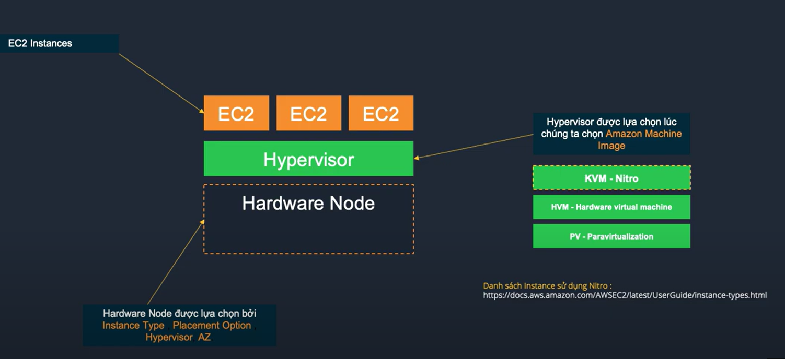

# Module 03 - Dịch vụ Compute VM trên AWS
- AWS Elastic Compute Cloud (EC2)
- Amazon Lightsail
- Amazon EFS / FSX
- AWS Application Migration Service (MGN)
---
## Module 03 - 01 - Amazon Elastic Compute Cloud (EC2)
## 01
  - **Amazon EC2** giống với máy chủ ảo hoặc máy chủ vật lí truyền thống. EC2 có khả năng **khởi tạo nhanh, khả năng co dãn tài nguyên mạnh mẽ** (**Elasticity**)
    - Có thể thay đổi, thêm bớt tài nguyên so với máy chủ truyền thống -> Nhiều người mở thêm máy chủ ảo, Ít người tắt bớt đi -> Tối ưu chi phí
    - Có thể nâng cấp cấu hình thuận tiện hơn máy chủ truyền thống -> Tuỳ theo tình hình, nhu cầu khách hàng có thể nâng cấp mở rộng trong thời gian ngắn
  - Amazon EC2 có thể đáp ứng workload hay bất cứ công việc nào mà máy chủ truyền thống làm được
## 02
  - Cấu hình của Amazon EC2 không được tuỳ chọn tuỳ ý, mà lựa chọn cấu hình thông qua việc lựa chọn các EC2 Instance type.
  - Instance type quyết định các yếu tố:
    - CPU (Intel/AMD/ARM (**Graviton 1/2/3**)) / GPU
    - Memory
    - Network
    - Storage
## 03
  **Kiến trúc EC2**
  - Hardware Node (Thiết bị phần cứng) sẽ được lựa chọn và quản lí bởi AWS dựa theo thông tin khởi tạo EC2 (Instace Type, Placement Option, Hypervisor, AZ)
    - Placement Option: cho phép nhiều EC2 nằm trên 1 HardwareNode để giảm latency, hoặc khác nhau để tránh tình huống ảnh hưởng lẫn nhau.  
  - Hypervisor (Nằm trên Hardware Node) đóng vai trò quản lí phần cứng, được lựa chọn lúc ta chọn Amazon Machine Image (Template) -> Khởi tạo máy ảo (như ổ C:/)
    - KVM - Nitro mới nhất có tốc độ nhanh hơn 30% (> HVM - Hardware Virtual Machine; PV - Paravirtualization)
  - EC2 (nằm trên lớp Hypervisor) là các máy chủ ảo có thuật ngữ là **EC2 Instances** thay vì Virtual Machine.
    - Không đánh đồng hiệu năng trên Cloud, hay so sánh cấu hình với On-Premise -> Cần chạy đánh giá hiệu năng thực tế 

## 04
  **AMI/Backup/Keypair**
  - Amazon Machine Image (AMI): có thể provision ra một hoặc nhiều EC2 Instances cùng lúc
    - AMI có sẵn của AWS trên AWS market place và custom AMI tự tạo từ EC2 Instances
    - AMI bao gồm root OS volumes, quyền sử dụng AMI quy định tài khoàn AWS được sử dụng và mapping EBS volume được tạo và gán vào EC2 Instances
 
  - EC2 Instance có thể được **backup** bằng cách tạo **snapshot**:
    - Snapshot đầu tiên full snapshot
    - Snapshot thứ 2 trở đi sẽ là in-cremental snapshot (chỉ lấy những cái thay đổi trên volume đó)
  - **Key pair** (public key và private key): dùng để mã hóa thông tin đăng nhập cho EC2 Instance
